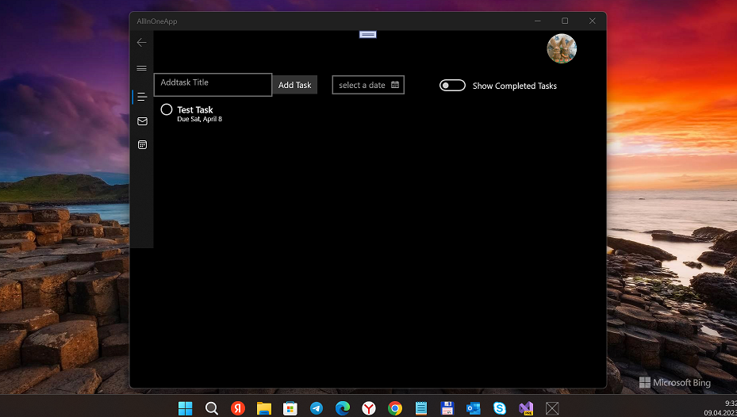
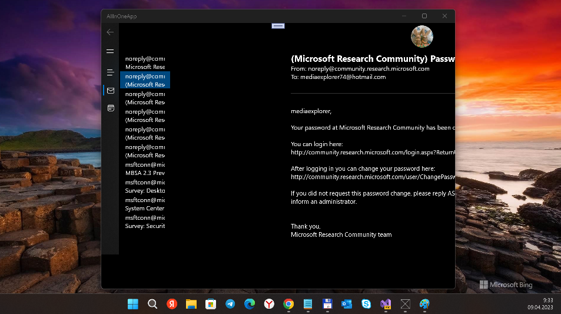
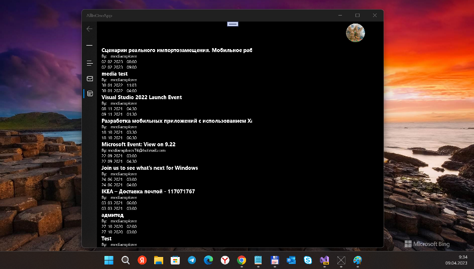

# AllInOneApp "15063"

## Screenshots

## My 2 cents
- I tried to process an codebase downgrade, so... welcome to W10M  & net standard 1.4
- I noticed that MS auth demaged at now.... it needs to be fixed.  

## Progress / Status
- Microsoft.Graph "block" updated to 4.0 (.net standard 1.4)
- Microsoft.Graph.Core updated to 2.x (.net standard 1.4)
- Azure.Core added (.net standard 1.4)
- System.Text.Json added (.net standard 1.4)

## Project Description

### Summary:
The motivation behind creating this app was to have just one app that enables all Microsoft apps. Due to limited time available, this app combines three Microsoft apps with limited functionality: To do, Mail, and Calendar.

### Current implementation:

ToDo : 
- Toggle between pending and completed task
- Add new task with due date
- Set task priority
- Update task status to done

Email :
- Shows only important emails

Calendar :
- Shows upcoming events
- Add new event
- Note: This application runs on client ID MainPage.xaml.cs so we need to change ID on line 38

### Repo URL
https://github.com/Dikshabhura/AllInOneApp/tree/Main

### Team members
- [Dikshabhura](https://github.com/Dikshabhura/)

## Bugs (?)
- Strange task list getting (locale-dependency). If I not localized "Tasks" string, getlist returns null.
- If no active tasks (all tasks completed), after "show completed tasks" switching on I got strange task list behavior (infinite repeats of task items)

## My Ideas
- Cell Surface Duo 1, install Project WOA/Duo, and build AllInOneApp for WindowsOnArm :)

## ..
AS IS. RnD only. DIY :)

## .
- me 2023

